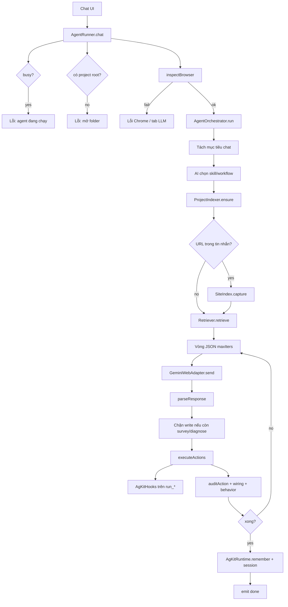

# Agentflow — luồng chạy NowK agent

NowK không gọi API LLM trực tiếp. UI gửi tin nhắn → `AgentRunner` kiểm tra Chrome + tab Gemini/ChatGPT/DeepSeek → `AgentOrchestrator` lặp: prompt JSON → model trả tool → NowK chạy tool trên disk/terminal → gửi kết quả lại cho đến khi xong (tối đa ~20–36 vòng, tùy số yêu cầu).

Sửa file **không** được coi là xong. `done=true` chỉ khi playbook của từng yêu cầu đã chạy, wiring/behavior ổn, và (nếu đã sửa code) có bằng chứng chạy lệnh / log terminal.

---

## Thành phần

| Lớp | File | Vai trò |
|-----|------|---------|
| Cổng chat | `utils/AgentRunner.js` | Session, provider, Chrome, gọi `orchestrator.run` |
| Vòng lặp | `utils/agent/AgentOrchestrator.js` | Plan, index, retrieve, JSON loop, gate, verify |
| Kit | `utils/agent/AgKitRuntime.js` | AI chọn rule/skill/workflow/agent từ nội dung `.agents` |
| Defaults | `utils/agent/AgentDefaults.js` | Vòng lặp, kit cap, index, retrieve, session |
| Hook | `utils/agent/AgKitHooks.js` | Chặn lệnh shell nguy hiểm trước khi chạy |
| Index | `utils/agent/indexer/ProjectIndexer.js` | Chunk code → vector store `.nowk/index.json` |
| Retrieve | `utils/agent/retriever/Retriever.js` | File + RELATION TREE + digest cho prompt |
| Tool | `utils/agent/ToolManager.js` | `read_file`, `edit_file`, `run_command`, … |
| LLM | `utils/agent/GeminiWebAdapter.js` + `chrome/*Agent` | Gửi prompt vào tab web, lấy text JSON |

Session (tối đa 16) nhớ `projectBrief`, `surveyDigest`, file đã sửa, 16 lượt chat gần nhất. Đổi folder thì reset survey.

---

## Tổng quan



---

## 1. Vào cửa: `AgentRunner.chat`

1. Một agent một lúc (`busy`).
2. Cần `projectRoot` và nội dung chat không rỗng.
3. Lấy/tạo session theo `sessionId`.
4. Gắn provider (`gemini` / `chatgpt` / `deepseek`) vào orchestrator.
5. `inspectBrowser`: Chrome đang mở, không native-mode, có tab khớp URL provider.
6. `getAutomationPage` rồi `orchestrator.run({ root, message, openFile, page, memory, controller })`.
7. `rememberSession` ghi memory + lượt chat.
8. Abort: `orchestrator.abort()` + cancel agent Chrome.

`openFile` chỉ gửi `{ path, lines }` — không gửi cả nội dung file.

---

## 2. AG Kit (nhanh, không vòng LLM)

`AgKitRuntime.route` chọn skill/rule bằng cosine trên mô tả (không hỏi model thêm). Luôn load `verify-changes`, `clean-code`, `core-protocol`.

- Ưu tiên `.agents` trong project, không thì kit của app.
- Catalog theo purpose + when (tiếng Việt hoặc English).
- **AI chọn kit**: `AgKitRuntime.route(..., { ask })` hỏi model JSON `{skills,workflows,agents,rules}` từ skill tree; cosine chỉ là fallback khi parse fail.
- `/slash` vẫn chọn workflow khi user gọi lệnh tường minh.
- Luôn load skill `verify-changes`, `clean-code`; rule `core-protocol`, `code-rules`.
- `.agents` được index vào vector store (folder ẩn khác vẫn bỏ).
- Chỉ **nội dung file đã chọn** vào prompt (cắt độ dài). Registry skill chỉ là tên + purpose.

Sau run: `remember` append một dòng vào `.agents/memory/feedback-history.md`.

---

## 3. Tách yêu cầu + playbook KIND

Trước index: `splitRequirements(task)` tại chỗ (một câu chat = một kế hoạch). Chỉ gọi LLM `planPrompt` khi tin nhắn là dump console. Không hỏi model để chọn kit.

Kế hoạch chat = **mục tiêu của user**, không phải bước implement:

- "hoàn thiện website" → 1 kế hoạch
- "hoàn thiện website và xóa file không dùng tới" → 2 kế hoạch (làm site, rồi xóa)

Không tách thành header / home / auth thành nhiều mục chat. Trong một kế hoạch: **list_files** → đánh giá file thiếu → **create_file từng file** (không nhét 10 file một JSON).

Mỗi requirement có `kind`: `feature` | `bugfix` | `update` | `refactor` | `style` | `remove` | `run` | `investigate`.

| Kind | Bắt buộc trước khi sửa |
|------|-------------------------|
| feature / update / style / refactor / remove / investigate | SURVEY RELATION TREE |
| bugfix | LOCATE + DIAGNOSE (nêu nguyên nhân) |
| run | `run_start` / `run_command`, không edit |

Orchestrator **lọc** `edit_file` / `create_file` / `run_*` khi `kindProgress` còn `survey` hoặc `diagnose`.

UI nhận event `plan` với từng việc: pending / in_progress / completed.

---

## 4. Index + retrieve

**Index** (`markPhase('index')`):

- Walk repo (bỏ `node_modules`, `.git`, `dist`, …), tối đa 600 file, depth 8.
- Chunk → `VectorStore`, cache `.nowk/index.json` theo size+mtime.
- Sau mỗi write thành công: `indexer.updateFile`.

**Website:** nếu task có URL và có `controller`, `SiteIndex.capture` nhét digest vào `surveyDigest`.

**Retrieve:**

- Search vector theo task + requirement hiện tại + entity alias (bàn, order, ipc, …).
- Mở rộng import (`→`) và imported-by (`←`) = RELATION TREE.
- Digest: likely files, CONNECTED SURFACES, chunk preview → `state.projectBrief`.

Phase chuyển `execute`.

---

## 5. Hợp đồng JSON với model

Mỗi lượt model phải trả **một object**:

```json
{
  "analysis": "một câu",
  "plan": ["file — việc"],
  "actions": [{ "type": "read_file", "path": "src/App.vue", "start": 1, "end": 80 }],
  "done": false
}
```

Tool chính: `retrieve`, `read_file`, `search_code`, `grep`, `edit_file`, `create_file`, `delete_file`, `mkdir`, `run_command`, `run_start`, `run_test`, `browser_open`, `screenshot`.

Protocol cấm: đánh dấu xong bằng README/`package.json`; `done=true` khi còn lỗi tool; nút/menu không có handler; state trùng trên popup vs màn chính.

---

## 6. Vòng lặp chính (`run`)

`maxIters = min(36, max(20, 8 * số requirement))`.

Mỗi iteration:

1. **Refusal nudge** — model bảo “không có tool” → nhắc NowK chạy JSON thật.
2. Gắn `start`/`end` cho `read_file` nếu analysis nêu số dòng; bỏ read trùng.
3. **Gate KIND** — còn survey/diagnose thì bỏ action write.
4. Read trùng hết, chưa có action mới → prompt playbook hoặc “đã đọc, hãy edit”.
5. Không action → `injectVerify` (tự đề xuất `run_command`/`run_start` nếu task cần chạy hoặc vừa sửa file).
6. Vẫn không action:
   - `shouldAdvanceRequirement` → requirement tiếp, retrieve lại, prompt playbook mới.
   - Còn việc / lỗi → `buildFixErrorsPrompt` / `buildKindPlaybookPrompt` / `buildKeepWorkingPrompt`.
   - Hết việc, đã sửa file, chưa đọc terminal → `afterEditsCheck`.
7. Có action → `executeActions` → `resultPrompt(results)` gửi lại model.

**Kết thúc vòng:** `markFinished` khi `workLeft` = false, hoặc hết iter, hoặc model không ra JSON hợp lệ khi vẫn còn việc.

---

## 7. `executeActions`

Với từng action:

- `skipWriteReason`: chặn sửa README / LICENSE / `package.json` meta nếu task không yêu cầu.
- `tools.run` — `edit_file` thiếu file → tự `create_file`; `old` lệch → đọc file nhét vào error.
- `auditAction` sau write.
- Event `tool` / `diff` / `audit`.
- Cập nhật index, plan progress, truncated create.
- Sau batch write: `verifyChanges`, `checkWiring`, `checkBehavior` → fail thì `done` không được.

**Hooks:** `run_command` / `run_test` / `run_start` / `run_build` qua `AgKitHooks.gateAction` (rm -rf `/`, mkfs, dd disk, curl|sh, chmod 777, …).

---

## 8. Điều kiện “còn việc” vs “xong”

`workLeft` / `taskSatisfied` (rút gọn):

- Còn requirement chưa làm, lỗi tool, file create bị cắt.
- Task sửa file nhưng chưa có file changed, hoặc chưa `run_*` khi cần evidence.
- Wiring: nhiều surface liên quan nhưng chưa đọc/sửa đủ / chưa đụng file cũ.
- Behavior: task nút/Electron mà chỉ sửa CSS, hoặc chưa đụng preload/main.
- Đổi rộng (toàn UI/site) mà chỉ 1 file (hoặc UI nhiều mà < 3 file).

**afterEditsCheck:** đọc log IDE. Log lỗi → prompt sửa. Log sẵn sàng + có URL local (`localhost`/`127.0.0.1`) → mở tab editor (`UrlPane`) và bắt console/overlay; lỗi → sửa tiếp. Log sạch, không URL → `done=true`. Tối đa 4 lần check.

---

## 9. Event UI (`onProgress`)

| type | Ý nghĩa |
|------|---------|
| `status` | Trạng thái (index, khảo sát, đang sửa, hoàn tất) |
| `step` | Kit loaded, kế hoạch, chặn write, terminal |
| `plan` | Danh sách requirement/plan |
| `working` | Tool đang chạy |
| `tool` / `diff` / `audit` / `verify` | Kết quả từng bước |
| `done` / `error` | Kết thúc |

---

## 10. File nên đọc khi sửa luồng

- Vòng lặp + prompt: `utils/agent/AgentOrchestrator.js` (`run`, `executeActions`, `isComplete`)
- Kind: `utils/agent/Requirements.js`
- Tool + hook: `utils/agent/ToolManager.js`, `utils/agent/AgKitHooks.js`
- Kit: `utils/agent/AgKitRuntime.js`
- Context: `utils/agent/retriever/Retriever.js`, `utils/agent/indexer/ProjectIndexer.js`
- Cổng: `utils/AgentRunner.js`
